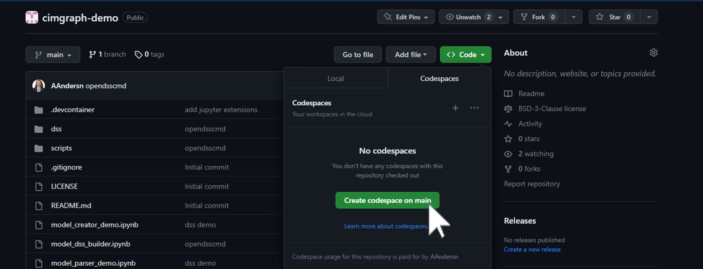
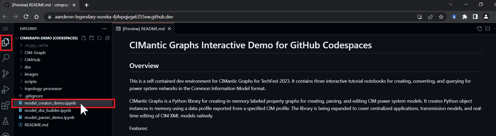
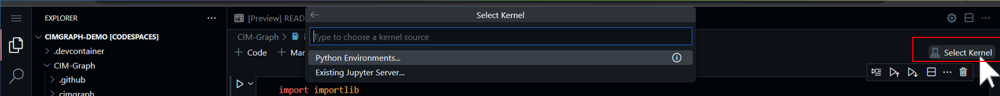
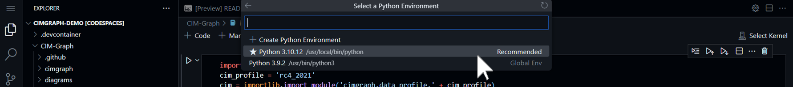
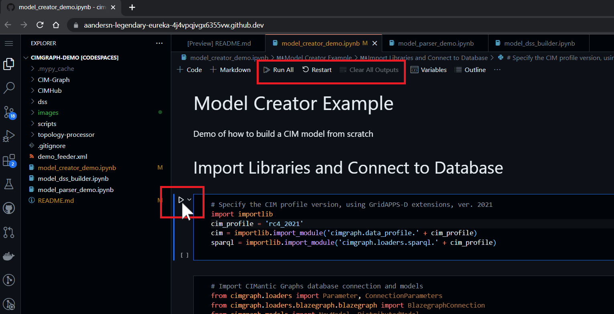

# CIMantic Graphs Interactive Demo for GitHub Codespaces

## Overview
This is a self contained dev environment for CIMantic Graphs for TechFest 2023. It contains three interactive tutorial notebooks for creating, converting, and querying for power system networks in the Common Information Model format.

CIMantic Graphs is a Python library for creating in-memory labeled property graphs for creating, parsing, and editing CIM power system models. It creates Python object instances in memory using a data profile exported from a specified CIM profile. The library is being expanded to cover centralized applications, transmission models, and real-time editing of CIM XML models natively.

Features:
* Open-source data engineering tool for management of CIM models
* Object-oriented data structure with enforcement of CIM Schema
* Data profiles generated directly from Enterprise Architect UML
* Support for custom profiles using CIMTool or SchemaComposer
* Support for direct creation / editing / parsing of CIM XML, JSON-LD
* API support for centralized/distributed transmission + distribution models

## Setup
To launch the demo, click on the "Code" button and then select "Create codespace on main"

It will take several minutes for GitHub to install the Blazegraph Database, OpenDSS, CIMHub, and CIM-Graph.

## Start Jupyter Notebooks

It is recommended to start with model_creator_demo. It covers the basic usage of CIM-Graph and syntax to create, edit, and parse CIM models.

When starting the notebook, select a kernel to use:

Then, run the notebook by advancing through the cells using `shift + enter` or using the play button

