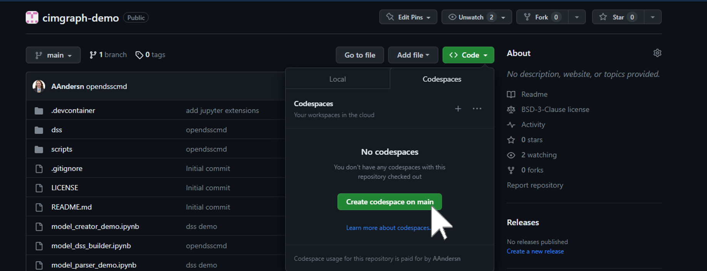

# CIM Tools Interactive Demo for GitHub Codespaces

A self-contained dev environment for exploring open-source **CIM** (Common
Information Model) power-system tooling. One codespace gives you three tools:

| Tool | What it is | How you use it |
|------|-----------|----------------|
| **CIMantic Graphs** (`cimgraph`) | Python library for creating, parsing, and editing CIM models as in-memory property graphs | Jupyter notebooks in VS Code |
| **CIMTool** | Eclipse RCP desktop app for CIM profiles and model validation | GUI on the noVNC desktop |
| **GLIMPSE** | Electron desktop app for visualizing power-system graphs | GUI on the noVNC desktop |

The notebooks read and write CIM models as **XML files directly** — there is no
database (no Blazegraph or other container) to set up.

## CIMantic Graphs

CIMantic Graphs creates Python object instances in memory using a data profile
generated from a specified CIM profile, and supports direct creation / editing /
parsing of CIM XML and JSON-LD.

Features:
* Open-source data engineering tool for management of CIM models
* Object-oriented data structure with enforcement of the CIM schema
* Data profiles generated directly from Enterprise Architect UML
* Support for custom profiles using CIMTool or SchemaComposer
* Direct creation / editing / parsing of CIM XML, JSON-LD
* API support for centralized/distributed transmission + distribution models

## Setup

Click the **Code** button and select **Create codespace on main**.



On first launch the container installs the Python environment (via `uv`), the
GUI runtime libraries, and downloads the **CIMTool** and **GLIMPSE** desktop apps.
This pulls roughly **1 GB** of release artifacts, so the first `postCreate` takes
several minutes — subsequent starts are fast (downloads are cached under `/opt`).

> **Architecture note:** CIMTool and GLIMPSE ship as x86_64/amd64 binaries. The
> codespace must run on an x86_64 host (the default) for the GUI apps to launch.

## Run the notebooks (CIMantic Graphs)

Open a notebook in VS Code and select the **`Python (cimgraph-demo)`** kernel.
Start with `build_network_demo.ipynb` — it walks through building a complete
CIM network model by hand, exporting it to CIM XML, and reading it back.


### Optional: OpenDSS export

The last section of `04_build_network_demo.ipynb` exports the model to OpenDSS
and solves a power flow. This needs the `cimhub-opendss` exporter and
`opendssdirect-py`, which are **not** installed by default (CIMHub is not yet
published to PyPI). Those cells detect the missing packages and skip cleanly. To
enable the section, install a local CIMHub checkout into the environment (see the
CIMHub project) and re-run the notebook.

## Run the GUI apps (CIMTool & GLIMPSE)

CIMTool and GLIMPSE run on a lightweight Linux desktop served in your browser.

1. Open the **Ports** tab and click the forwarded **port 6080**
   ("CIMTool + GLIMPSE Desktop (noVNC)"). It also auto-opens on first create.
2. When prompted for the noVNC password, enter **`cimtool`**.
3. **Right-click the desktop** and choose **CIMTool** (morning session) or
   **GLIMPSE** (afternoon session) from the menu.

Either app can also be started from a terminal (the VS Code terminal works too):

```bash
scripts/launch-cimtool.sh   # CIMTool
scripts/launch-glimpse.sh   # GLIMPSE
```

CIMTool opens on the `~/cimtool-ws` workspace with the **CGMES-CIM17** project
(cloned at setup) already in its Project Explorer — no manual import needed.

### Sample CIM models

Two IEEE feeder models are downloaded into `sample_models/` at setup:

* **`sample_models/IEEE9500bal.xml`** (~54 MB) — the headline demo model.
* **`sample_models/IEEE13.xml`** (~407 KB) — a small fallback if the software-rendered
  graph is slow on the noVNC desktop.

**In GLIMPSE:** click **Load**. GLIMPSE's file dialog opens at your home folder,
where the samples are linked into **`~/glimpse-ws`** (also pinned in the dialog's
sidebar as *GLIMPSE samples*) — pick a model there. The files themselves stay in
`sample_models/`; `~/glimpse-ws` just holds links so the dialog can see them.

**In CIMTool:** import from `sample_models/` in the workspace.
